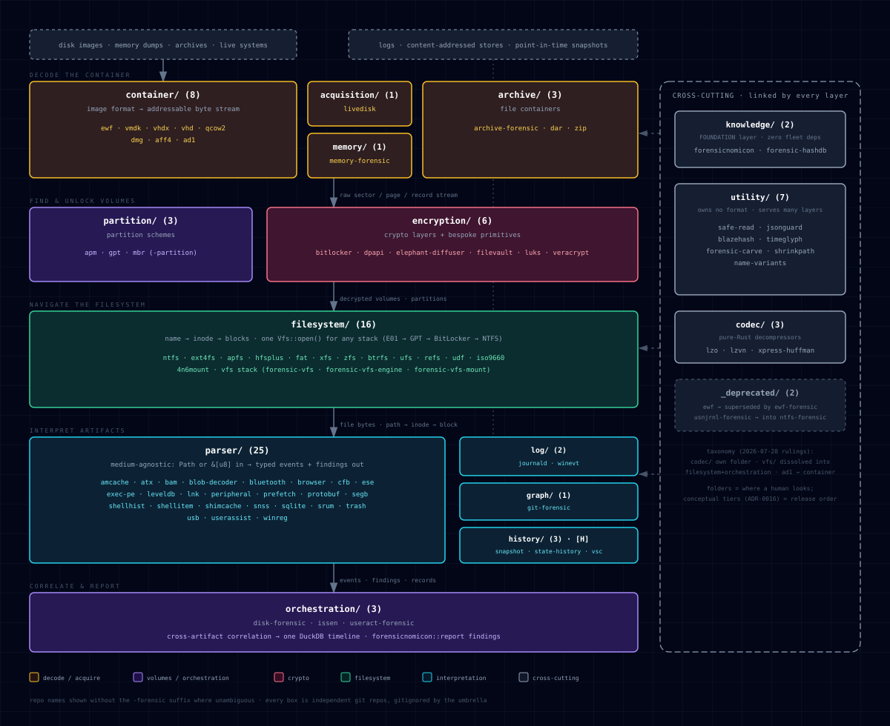

<p align="center">
  
  
</p>

# ronin-issen — the SecurityRonin forensic fleet

**The image is acquired. The clock is running. Point Issen at it and read the story.**

Hand **Issen** a disk image and a memory dump and it hands back one correlated,
ATT&CK-mapped timeline — the attack narrative, ready to read and drop into a report.
One command. One static binary. No Python, no dependency hell.

```bash
# Ingest disk + memory, auto-detect the container, parse every artifact, correlate.
issen evidence.E01 memory.raw -o case.duckdb

# Read the story — as text, or a shareable HTML report.
issen report case.duckdb --format text
```

That is the whole workflow. Issen auto-detects E01/EWF/VMDK/raw and memory dumps,
triages the filesystem for the artifacts that matter — registry, EVTX, prefetch,
browser, LNK, SRUM, shell history, Biome — parses each, and correlates across disk,
memory, logs, live response, and supply chain into one queryable timeline. Re-run it
and it only re-parses what changed: a crash, a new source, or a repeat run picks up
where it stopped instead of redoing the case.

**Try it on the case already on your desk.** → Get Issen: **[SecurityRonin/issen](https://github.com/SecurityRonin/issen)**

---

## What you get

- **One timeline across five kinds of evidence** — disk `[P]`, memory `[M]`, logs `[L]`,
  live query `[Q]`, and content-addressed supply chain `[C]`.
- **Findings with the full chain, not loose facts.** A network connection, a hidden PID,
  a loaded rootkit library, and a supply-chain hash match arrive as one story — with
  severity, rule name, and the evidence behind each.
- **Output you can hand off** — plain text for a quick read, HTML for a shareable report.

<p align="center">
  
</p>

---

## Under the hood — the fleet (for developers &amp; maintainers)

Issen is the thin front door. Behind it is a fleet of **86 standalone Rust forensic
libraries** — each a deep expert in one artifact family, each usable on its own in your
tooling, all pure-Rust, input-fuzzed, panic-free by lint, single static binary.

`ronin-issen` is the fleet's **governance umbrella**: it holds the constitution
([`CLAUDE.md`](CLAUDE.md)), the decisions ([`docs/decisions/`](docs/decisions/) — the
folder umbrella + taxonomy [ADR-0017](docs/decisions/0017-fleet-folder-umbrella-taxonomy.md),
the layer architecture [ADR-0016](docs/decisions/0016-multi-repo-layer-architecture.md),
release order [ADR-0006](docs/decisions/0006-fleet-dependency-layering-release-order.md)),
and the canonical component map below. The component repos live under
`components/<category>/<repo>` as their **own independent git repos**, gitignored here —
deliberately *not* a monorepo. The interactive diagram is
[`docs/components-diagram.html`](docs/components-diagram.html).

### Component layout (canonical)

`components/<category>/<repo>` — **86 repos, 16 folders**. The component tree is the
registry; this table is its canonical statement. Categories group by the **proximity
rule**: same conceptual idea → same folder; contract crates live with their families;
sub-groups get a label here, not a folder.

| Category | Role | Repos |
|---|---|---|
| `knowledge/` (2) | FOUNDATION leaf — compile-time format facts, hash DBs; zero fleet deps | [forensic-hashdb](https://github.com/SecurityRonin/forensic-hashdb) · [forensicnomicon](https://github.com/SecurityRonin/forensicnomicon) |
| `utility/` (7) | cross-cutting mechanisms — owns no format, serves many layers | [blazehash](https://github.com/SecurityRonin/blazehash) · [forensic-carve](https://github.com/SecurityRonin/forensic-carve) · [jsonguard](https://github.com/SecurityRonin/jsonguard) · [name-variants](https://github.com/SecurityRonin/name-variants) · [safe-read](https://github.com/SecurityRonin/safe-read) · [shrinkpath](https://github.com/SecurityRonin/shrinkpath) · [timeglyph](https://github.com/SecurityRonin/timeglyph) |
| `codec/` (3) | pure-Rust decompressors | [lzo](https://github.com/SecurityRonin/lzo) · [lzvn](https://github.com/SecurityRonin/lzvn) · [xpress-huffman](https://github.com/SecurityRonin/xpress-huffman) |
| `container/` (8) | decode an image/dump → addressable byte stream | [ad1-forensic](https://github.com/SecurityRonin/ad1-forensic) · [aff4-forensic](https://github.com/SecurityRonin/aff4-forensic) · [dmg-forensic](https://github.com/SecurityRonin/dmg-forensic) · [ewf-forensic](https://github.com/SecurityRonin/ewf-forensic) · [qcow2-forensic](https://github.com/SecurityRonin/qcow2-forensic) · [vhd-forensic](https://github.com/SecurityRonin/vhd-forensic) · [vhdx-forensic](https://github.com/SecurityRonin/vhdx-forensic) · [vmdk-forensic](https://github.com/SecurityRonin/vmdk-forensic) |
| `acquisition/` (1) | live-host disk enumeration + acquisition-integrity grading | [livedisk-forensic](https://github.com/SecurityRonin/livedisk-forensic) |
| `archive/` (3) | file containers (not raw disks) | [archive-forensic](https://github.com/SecurityRonin/archive-forensic) · [dar-forensic](https://github.com/SecurityRonin/dar-forensic) · [zip-forensic](https://github.com/SecurityRonin/zip-forensic) |
| `partition/` (3) | partition schemes | [apm-partition-forensic](https://github.com/SecurityRonin/apm-partition-forensic) · [gpt-partition-forensic](https://github.com/SecurityRonin/gpt-partition-forensic) · [mbr-partition-forensic](https://github.com/SecurityRonin/mbr-partition-forensic) |
| `encryption/` (6) | crypto layers + bespoke primitives | [bitlocker-forensic](https://github.com/SecurityRonin/bitlocker-forensic) · [dpapi-forensic](https://github.com/SecurityRonin/dpapi-forensic) · [elephant-diffuser](https://github.com/SecurityRonin/elephant-diffuser) · [filevault-forensic](https://github.com/SecurityRonin/filevault-forensic) · [luks-forensic](https://github.com/SecurityRonin/luks-forensic) · [veracrypt-forensic](https://github.com/SecurityRonin/veracrypt-forensic) |
| `filesystem/` (16) | navigate sectors by path (name→inode→block); vfs stack + FUSE mount | [4n6mount](https://github.com/SecurityRonin/4n6mount) · [apfs-forensic](https://github.com/SecurityRonin/apfs-forensic) · [btrfs-forensic](https://github.com/SecurityRonin/btrfs-forensic) · [ext4fs-forensic](https://github.com/SecurityRonin/ext4fs-forensic) · [fat-forensic](https://github.com/SecurityRonin/fat-forensic) · [forensic-vfs](https://github.com/SecurityRonin/forensic-vfs) · [forensic-vfs-engine](https://github.com/SecurityRonin/forensic-vfs-engine) · [forensic-vfs-mount](https://github.com/SecurityRonin/forensic-vfs-mount) · [hfsplus-forensic](https://github.com/SecurityRonin/hfsplus-forensic) · [iso9660-forensic](https://github.com/SecurityRonin/iso9660-forensic) · [ntfs-forensic](https://github.com/SecurityRonin/ntfs-forensic) · [refs-forensic](https://github.com/SecurityRonin/refs-forensic) · [udf-forensic](https://github.com/SecurityRonin/udf-forensic) · [ufs-forensic](https://github.com/SecurityRonin/ufs-forensic) · [xfs-forensic](https://github.com/SecurityRonin/xfs-forensic) · [zfs-forensic](https://github.com/SecurityRonin/zfs-forensic) |
| `memory/` (1) | memory dump → page stream; OS-structure walking | [memory-forensic](https://github.com/SecurityRonin/memory-forensic) |
| `log/` (2) | navigate a log stream by timestamp / record number | [journald-forensic](https://github.com/SecurityRonin/journald-forensic) · [winevt-forensic](https://github.com/SecurityRonin/winevt-forensic) |
| `parser/` (25) | interpret artifact records → forensic meaning (medium-agnostic) | [amcache-forensic](https://github.com/SecurityRonin/amcache-forensic) · [atx-forensic](https://github.com/SecurityRonin/atx-forensic) · [bam-forensic](https://github.com/SecurityRonin/bam-forensic) · [blob-decoder](https://github.com/SecurityRonin/blob-decoder) · [bluetooth-forensic](https://github.com/SecurityRonin/bluetooth-forensic) · [browser-forensic](https://github.com/SecurityRonin/browser-forensic) · [cfb-forensic](https://github.com/SecurityRonin/cfb-forensic) · [ese-forensic](https://github.com/SecurityRonin/ese-forensic) · [exec-pe-forensic](https://github.com/SecurityRonin/exec-pe-forensic) · [leveldb-forensic](https://github.com/SecurityRonin/leveldb-forensic) · [lnk-forensic](https://github.com/SecurityRonin/lnk-forensic) · [peripheral-forensic](https://github.com/SecurityRonin/peripheral-forensic) · [prefetch-forensic](https://github.com/SecurityRonin/prefetch-forensic) · [protobuf-forensic](https://github.com/SecurityRonin/protobuf-forensic) · [segb-forensic](https://github.com/SecurityRonin/segb-forensic) · [shellhist-forensic](https://github.com/SecurityRonin/shellhist-forensic) · [shellitem](https://github.com/SecurityRonin/shellitem) · [shimcache-forensic](https://github.com/SecurityRonin/shimcache-forensic) · [snss-forensic](https://github.com/SecurityRonin/snss-forensic) · [sqlite-forensic](https://github.com/SecurityRonin/sqlite-forensic) · [srum-forensic](https://github.com/SecurityRonin/srum-forensic) · [trash-forensic](https://github.com/SecurityRonin/trash-forensic) · [usb-forensic](https://github.com/SecurityRonin/usb-forensic) · [userassist-forensic](https://github.com/SecurityRonin/userassist-forensic) · [winreg-forensic](https://github.com/SecurityRonin/winreg-forensic) |
| `graph/` (1) | content-addressed / Merkle-DAG navigation | [git-forensic](https://github.com/SecurityRonin/git-forensic) |
| `history/` (3) | [H] state-history temporal cohorts | [snapshot-forensic](https://github.com/SecurityRonin/snapshot-forensic) · [state-history-forensic](https://github.com/SecurityRonin/state-history-forensic) · [vsc-forensic](https://github.com/SecurityRonin/vsc-forensic) |
| `orchestration/` (3) | cross-artifact correlation → one unified timeline | [disk-forensic](https://github.com/SecurityRonin/disk-forensic) · [issen](https://github.com/SecurityRonin/issen) · [useract-forensic](https://github.com/SecurityRonin/useract-forensic) |
| `_deprecated/` (2) | superseded; kept for reference | [ewf](https://github.com/SecurityRonin/ewf) · [usnjrnl-forensic](https://github.com/SecurityRonin/usnjrnl-forensic) |

These folders govern **where a human looks**. The conceptual dependency **tiers**
(FOUNDATION → CONTAINER → … → ORCHESTRATION — [ADR-0016](docs/decisions/0016-multi-repo-layer-architecture.md))
govern **what may import what**; the bottom-up **publish order** that graph forces is
its corollary ([ADR-0006](docs/decisions/0006-fleet-dependency-layering-release-order.md)).
Related but not 1:1 — the **16 folders collapse onto 5 dependency tiers** (e.g. `knowledge/`,
`utility/`, and `codec/` are three folders but one zero-dep tier; `utility`/`codec` are
cross-cutting rails depended on from every tier, not a rung). A folder is chosen by *what a
repo is*; its tier is *derived from what it imports*.

---

Private · © 2026 Security Ronin Ltd
